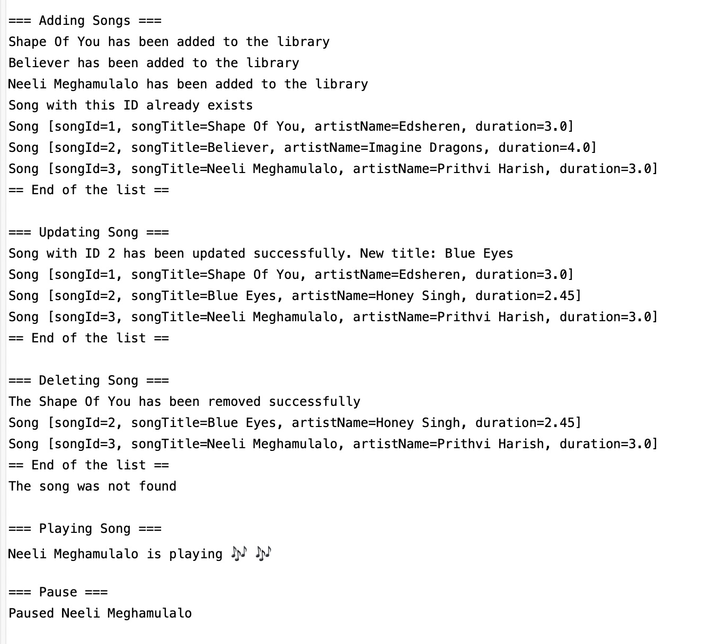

# Console-Based Music Player

A simple console-based music player built using **Core Java** demonstrating **Object-Oriented Programming (OOP)** principles and the **Java Collections Framework**.

This application simulates the basic functionality of a music player where users can manage songs, create playlists, and control playback operations using a console interface.

---

## Overview

This project was developed to practice and demonstrate key Java concepts including:

- Object-Oriented Programming (OOP)
- Interface-driven design
- Java Collections Framework
- Object equality using `equals()` and `hashCode()`
- Iteration using `Iterator`

The system maintains a **song library** and allows users to organize songs into **playlists** and perform playback operations.

---

## Problem Statement

Modern music players rely on complex frameworks and advanced architectures.  
This project demonstrates how a simplified music player can be built using **pure Core Java concepts without any frameworks**.

The application allows users to:
- Add songs to a music library
- Update song details
- Delete songs
- Play individual songs
- Pause and stop playback
- Create playlists
- Add songs to playlists
- Play songs from a playlist

---

## Core Entities

### Song

Represents a song in the music library.

Attributes:
- `songId`
- `songTitle`
- `artistName`
- `duration`

Each song is uniquely identified using **songId**.

---

### PlayList

Represents a collection of songs grouped together.

Attributes:

- `playlistName`
- `List<Song> songs`

A playlist can contain multiple songs from the main music library.

---

## Interface Design

### MusicPlayer Interface

The `MusicPlayer` interface defines the contract for all operations supported by the music player.

Methods include:
- `addSong(Song song)`
- `updateSong(int songId, String title, String artistName, double duration)`
- `deleteSong(int songId)`
- `playSong(int songId)`
- `pauseSong()`
- `stop()`
- `displayAllSongs()`
- `createPlayList(String playListName)`
- `addSongToPlaylist(String playListName, List<Song> songs)`
- `playPlaylist(String playListName)`

Using an interface helps separate **behavior definition** from **implementation**, following good OOP design principles.

---

## Implementation

### MusicPlayerImpl

`MusicPlayerImpl` provides the implementation of the `MusicPlayer` interface.

Responsibilities include:
- Managing the **main music library**
- Creating and managing **playlists**
- Tracking the **currently playing song**
- Preventing duplicate songs in playlists

---

## Key Concepts Demonstrated

### Object-Oriented Programming

- Classes and Objects
- Encapsulation
- Interface implementation
- Modular design

### Java Collections Framework

- `ArrayList`
- Iteration using `Iterator`
- Dynamic data storage

### Object Equality

The `Song` class overrides:

- `equals()`
- `hashCode()`

Equality is defined using **songId** to ensure duplicate songs are not added to playlists.

---

## Features

### Song Management

- Add songs to the music library
- Update song information
- Delete songs from the library
- Display all songs

### Playback Controls

- Play a song
- Pause the current song
- Stop playback

### Playlist Management

- Create playlists
- Add songs to playlists
- Prevent duplicate songs
- Play all songs in a playlist

---

## Project Structure

```
music-player
│
├── src
│   └── com
│       ├── Song.java
│       ├── PlayList.java
│       ├── MusicPlayer.java
│       ├── MusicPlayerImpl.java
│       └── MusicPlayerTest.java
│
├── screenshots
│   └── console-output.jpeg
│
└── .gitignore
```

---

## How to Run

1. Clone the repository

```
git clone https://github.com/Harsha-vardhan-7/music-player.git
```

2. Open the project in any Java IDE such as:

- IntelliJ IDEA
- Eclipse
- VS Code

3. Run the following class:

```
MusicPlayerTest.java
```

This class demonstrates all functionalities of the music player.

---

## Sample Output

```
=== Adding Songs ===
Shape Of You has been added to the library
Believer has been added to the library

=== Playlist creation ===
Playlist created successfully: Harsha

=== Playing Playlist ===
Playing Neeli Meghamulalo
Playing Believer
```

---

## Console Output Demo

Below is a sample execution of the music player application.



---

## Technologies Used

- Java
- Core Java
- Java Collections Framework
- Object-Oriented Programming

---

## Author

Harsha Vardhan Chundru

GitHub  
https://github.com/Harsha-vardhan-7
